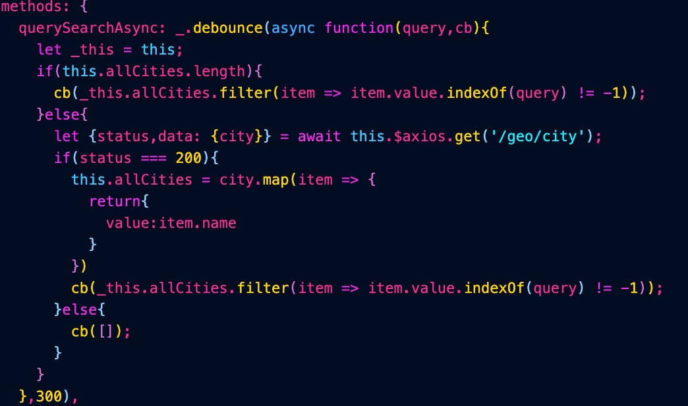

# nuxt.js koa2 mongoDB redis

### Passport

Passport是Node.js的身份验证中间件。Passport非常灵活和模块化，可以毫不费力地放入任何 基于Express的Web应用程序中。一套全面策略支持认证使用的用户名和密码

[Passport.js](http://www.passportjs.org/)

### # **[koa-redis](https://github.com/koajs/koa-redis)**

具有Sentinel和集群支持的Koa会话中间件/缓存的Redis存储

[GitHub - koajs/koa-redis: Redis storage for Koa session middleware/cache with Sentinel and Cluster support](https://github.com/koajs/koa-redis)

### # NODEMAILER

Nodemailer是Node.js应用程序的一个模块，可以方便地发送像蛋糕一样的电子邮件。该项目始于2010年，当时还没有发送电子邮件的合理选择，今天它是大多数Node.js用户默认求助的解决方案。

[Nodemailer :: Nodemailer](https://nodemailer.com/about/)

### Crypto.js

[https://github.com/brix/crypto-js]
[https://www.npmjs.com/package/crypto-js]

用于加密标准的JavaScript库

```shell
$ npm i crypto-js
```

Usage
ES6 import for typical API call signing use case:

```js
import sha256 from 'crypto-js/sha256';
import hmacSHA512 from 'crypto-js/hmac-sha512';
import Base64 from 'crypto-js/enc-base64';
const message, nonce, path, privateKey; // ...
const hashDigest = sha256(nonce + message);
const hmacDigest = Base64.stringify(hmacSHA512(path + hashDigest, privateKey));

or

password: CryptoJS.MD5(pwd)
```

## 项目踩坑记

> 1. 配置时
>    2.在注册页面和注册功能完成后,测试了几次成功的连接MongoDB和验证,
>    但是当我打算Github 的时候测试发现获取验证码功能失效,注册邮箱收不到验证码,初步排查是 `Passport`与`Nodemailer`第三方依赖没配置好,最后发现是腾讯SMTP服务的授权码出现问题.


在写 `切换城市`的时候因为使用第三方 API,因为某特定网络原因一直无法获取数据,尝试换了一个网络后,成功获取到数据  0.o !

> 开始前的一些补充:
> 1.目录
> 
> > `pages`文件夹是放一些页面的,在nuxt里pages的.vue文件将会自动映射到路由是,访问时可 localhost:3000/about 即可
> > `layouts` 类似于模板的存放文件夹后者vue里的router-view组件标签
> > `server` 用于存放服务端代码
> > plugins 第三方插件

//如果想用 esm模块化开发的话
//1.将package.json文件 npm run dev 命令里添加 "--exec babel-node"
//2.添加依赖 babel-preset-es2015 babel-cli -babel-core

#### css sass的依赖

npm i node-sass sass-loader --D  //安装后不用配置

### background-size

background-size 设置背景图片大小。图片可以保有其原有的尺寸，或者拉伸到新的尺寸，或者在保持其原有比例的同时缩放到元素的可用空间的尺寸。

```css
/* 关键字 */
background-size: cover
background-size: contain
/* 一个值: 这个值指定图片的宽度，图片的高度隐式的为auto */
background-size: auto  //单位可以是em,px,%
/* 两个值 */
/* 第一个值指定图片的宽度，第二个值指定图片的高度 */
background-size: auto 6px
/* 逗号分隔的多个值：设置多重背景 */
background-size: auto, auto     /* 不同于background-size: auto auto */
background-size: 6px, auto, contain
/* 全局属性 */
background-size: inherit;
background-size: initial;
background-size: unset;
```

> https://developer.mozilla.org/zh-CN/docs/Web/CSS/background-size

在项目中遇到 background-size: initial;


在写下面这个方法的时候

```js
//刚开始写的是箭头函数
_.debounce(async (query,cb) => {}
querySearchAsync: _.debounce(async function(query,cb){}
//导致一直无法获取
allCities
```


